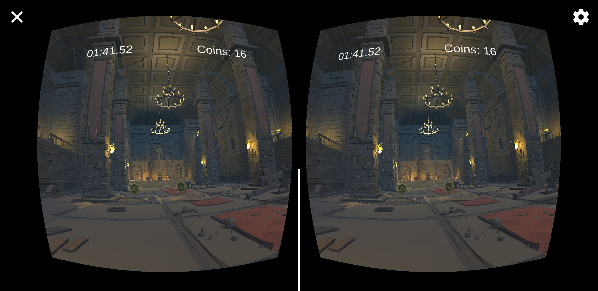
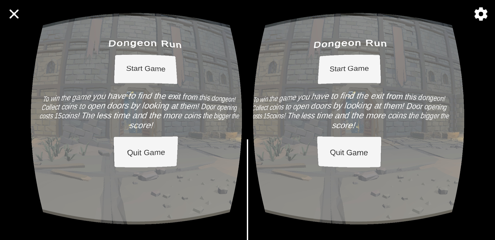
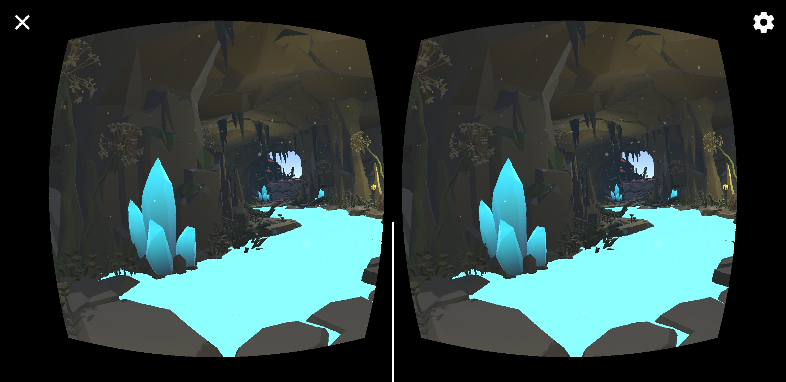
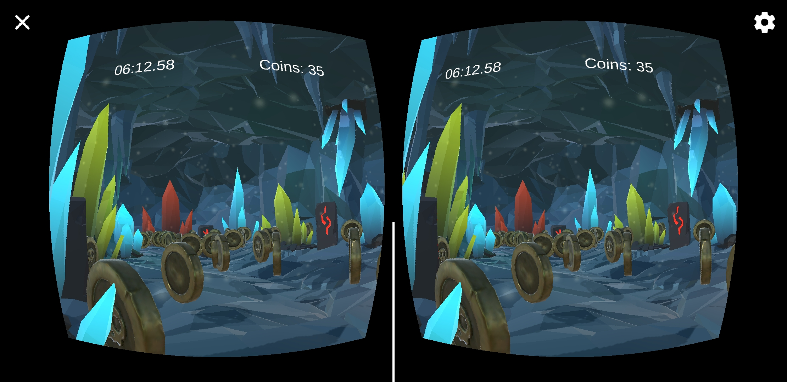

# Dungeon Run - Unity VR Project

"Dungeon Run" is a Virtual Reality game developed for Android devices using Unity 2022 and the Google Cardboard VR platform. Players explore a dynamically generated dungeon, collecting coins and unlocking doors to find a way out. The game combines exploration, strategy, and resource management within a captivating low poly 3D dungeon environment.

## Game Overview

In "Dungeon Run," players assume the role of a knight trapped within the confines of a mysterious dungeon. The primary goal is to navigate through various rooms and corridors, collect coins, unlock doors, and find the exit. The game features engaging exploration mechanics, where opening doors depletes coins, adding a strategic layer to resource management.

## Required Assets

"Dungeon Run" utilizes a combination of purchased and free assets to achieve its low poly 3D aesthetic. Most assets were acquired through Humble Bundle, offering a cost-effective solution for high-quality game assets. Key assets include:

- **Dungeon Assets**: [POLYGON Dungeons by Synty](https://assetstore.unity.com/packages/3d/environments/dungeons/polygon-dungeons-low-poly-3d-art-by-synty-102677) - A comprehensive set of modular low poly 3D art for creating diverse dungeon environments.
- **Performance Tools**: [Performance Tools](https://assetstore.unity.com/packages/tools/utilities/performance-tools-80534#description) significantly improved game performance on mobile devices.
- **Pirate Coin**: [Pirate Coin](https://assetstore.unity.com/packages/3d/props/pirate-coin-207743) used as in-game currency for unlocking doors and contributing to the final score.
- **Footstep Sound Pack**: [Footsteps Sound Pack](https://assetstore.unity.com/packages/audio/sound-fx/foley/footsteps-sound-pack-165660) provides various footstep sounds, adding realism to player movement.
- **Ambient Fantasy Music by Garni**: [Garni - Ambient Fantasy Music](https://assetstore.unity.com/packages/audio/ambient/fantasy/garni-ambient-fantasy-music-228355) enhances the dungeon exploration atmosphere.
- **Basic Motions**: [Basic Motions](https://assetstore.unity.com/packages/3d/animations/basic-motions-157744) offers a range of animations for the player character, improving visual storytelling and gameplay dynamics.

## Development Environment and Tools

- **Unity 2022.3.17f**: The primary development platform, known for its comprehensive set of features for 2D and 3D game development.
- **Google Cardboard SDK**: Integrated VR functionalities and ensured compatibility with Google Cardboard, making "Dungeon Run" a portable and accessible VR game.
- **JetBrains Rider 2023.3.2**: Used for scripting and debugging, offering robust IDE features like code navigation, auto-completion, and refactoring tools.

## Getting Started

1. **Clone the repository** to your local machine using Git.
2. **Open the project in Unity 2022.3.17f** or later.
3. **Import the required assets** listed above. Note that some assets might need to be purchased from their respective platforms.
4. **Set up the Google Cardboard SDK** in your Unity project following the official documentation.
5. **Build and run the project** on your Android device.

## Contribution

Contributions to "Dungeon Run" are welcome! If you have suggestions for improvements or encounter any issues, please feel free to open an issue or submit a pull request.

# Game Release

The latest version of "Dungeon Run" is available as a downloadable APK in the [Releases](https://github.com/Manchov/Dungeon_Run_VR/releases) section of this repository. This APK is compatible with Android devices and has been optimized for use with Google Cardboard VR.

## Installation Instructions

To install "Dungeon Run" on your Android device, follow these steps:

1. Navigate to the [Releases](https://github.com/Manchov/Dungeon_Run_VR/releases) section of this GitHub repository.
2. Download the latest `.apk` file from the list of releases.
3. Transfer the downloaded `.apk` file to your Android device.
4. On your Android device, navigate to Settings > Security, and enable "Unknown sources" to allow installation of apps from sources other than the Google Play Store.
5. Use a file manager app to locate the `.apk` file on your device and tap it to begin the installation process.
6. Follow the on-screen instructions to install the game.
7. Once installed, tap the "Dungeon Run" icon from your device's app drawer to start the game.

## How to Play

"Dungeon Run" is a VR exploration game where you navigate through a mysterious dungeon, collecting coins and finding the exit. To play "Dungeon Run," you'll need any Google Cardboard-compatible VR headset.

1. Launch the game on your Android device and place the device into your Google Cardboard VR headset.
2. Navigate through the dungeon by looking around in your VR environment. The game uses head-tracking to control movement direction.
3. Interact with objects, collect coins, and unlock doors by focusing your gaze on interactive elements within the game.
4. Find the exit to complete the dungeon run and achieve the highest score possible by collecting coins and completing the dungeon in the shortest time.

## Game Screenshots

---

Enjoy exploring the dungeon in "Dungeon Run"!
